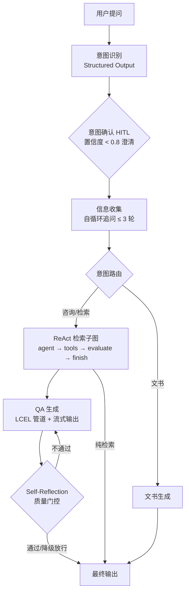

<p align="center">
  
</p>

<h1 align="center">LegalMind · 智能法律咨询系统</h1>

<p align="center">
  
  
  
  
  
</p>

<p align="center">
  基于 LLM + RAG 的智能法律咨询平台 —— LangGraph 多 Agent 协同工作流、HITL 人机协同、ReAct 检索子图、混合检索与 Self-Reflection 质量门控，提供专业、精准、可控的法律智能服务。
</p>

---

## ✨ 功能特性

### 核心功能

- **💬 智能法律问答** — 基于 LangGraph Agent 工作流，精准识别用户意图，结合 RAG 检索结果生成有据可依的法律解答
- **🔍 案例检索** — 语义向量 + BM25 关键词混合检索 + BGE-Reranker 重排序，快速定位相关法律案例
- **📝 法律文书生成** — 自动生成民事起诉状、答辩状、律师函等专业法律文书
- **🔄 流式对话** — SSE 实时流式输出 + 分阶段进度时间线（意图识别 → 检索 → 生成 → 质量自检），过程透明可见
- **📚 多轮对话** — LangGraph Checkpointer（PostgresSaver）持久化对话状态，支持 HITL 中断恢复与上下文延续
- **🔐 用户认证** — JWT 身份认证，保护用户数据安全

### 技术亮点

- **🤝 Human-in-the-Loop 人机协同** — 三个 HITL 检查点：意图确认（置信度 < 0.8 触发澄清）、多轮信息收集（LLM 判断信息不足时自循环追问，最多 3 轮）、检索质量评估（结果不足时引导用户补充），基于 LangGraph `interrupt` API 实现
- **🪞 Self-Reflection 质量门控** — 生成-评估-修正循环：回答生成后由评审 LLM 按清单自评（忠实性一票否决 / 针对性 / 可操作性），不通过则带反馈重新生成；草稿不入对话历史，重试额度封顶防循环，评审失败降级放行
- **💰 Token 用量全链路追踪** — `BaseCallbackHandler` 采集每次 LLM 调用用量 → ContextVar 请求级归集 → SSE `usage` 事件 → PostgreSQL JSONB 落库 → 前端展示"消耗 N tokens（输入/输出/调用次数）"
- **🧹 Context 管理** — 视图裁剪（字符预算 + 轮次边界对齐）+ 增量摘要压缩（结构化事实提取：金额/期限/法条/时效），checkpoint 全量保留历史，防长对话 Context 爆炸
- **🛡️ LLM 容灾链** — 主/备 DeepSeek 双实例 `with_fallbacks`，6 类网络/限流异常显式配全，流式场景自动切换
- **🛠️ Tool Calling + 参数校验** — `search_cases` Tool 使用 Pydantic Schema 校验（年份范围、案由枚举），LLM 自动提取结构化参数，4 层错误处理架构
- **🧩 ReAct 检索子图** — 自行封装的 4 节点子图（agent → tools → evaluate → finish），支持自动重试与 HITL 介入
- **📊 混合检索管线** — BM25 + 向量检索 + RRF（Reciprocal Rank Fusion）融合 + BGE-Reranker-v2-m3 精排
- **📐 Structured Output** — `with_structured_output(method="function_calling")` 约束 LLM 输出格式（意图识别 / 元数据抽取 / 质量评审）
- **🚨 统一错误体系** — RFC 9457 Problem Details 规范（type/title/status/detail/code/traceId），TraceId 纯 ASGI 中间件贯穿请求与日志，SSE 错误走结构化事件不破坏流
- **📡 LangSmith 全链路追踪** — 覆盖意图识别 → 检索 → 重排 → 生成全链路，LCEL 管道使消息组装/模板渲染步骤可观测
- **📋 RAGAS 评估体系** — 100 条标注数据集 + RAGAS 4 指标评估（faithfulness / answer_relevancy / context_precision / context_recall）+ 自定义 LLM Judge

## 🏗️ 工作流架构



## 🛠️ 技术栈

| 后端                   | 前端                    | 基础设施          |
| ---------------------- | ----------------------- | ----------------- |
| Python 3.14+           | Vue 3 (Composition API) | PostgreSQL 16     |
| FastAPI                | Vite 8                  | Redis 7           |
| LangChain / LangGraph  | Tailwind CSS 4          | Docker Compose    |
| Tortoise ORM           | Pinia 状态管理          | Chroma 向量数据库 |
| JWT (python-jose)      | Vue Router 5            | LangSmith 追踪    |
| BGE-Reranker-v2-m3     | Axios / marked          | —                |
| LangGraph Checkpointer | —                      | —                |

## 🚀 快速开始

### 前置条件

- Python >= 3.14（[安装 uv](https://docs.astral.sh/uv/getting-started/installation/)）
- Node.js >= 18 + pnpm
- Docker & Docker Compose（用于启动数据库）

### 1. 克隆项目

```bash
git clone https://github.com/your-username/legal-mind.git
cd legal-mind
```

### 2. 启动基础设施

```bash
docker compose up -d
```

此命令会启动 PostgreSQL 16 和 Redis 7，并创建 `legal_db` 数据库。

### 3. 启动后端

```bash
cd backend

# 创建环境变量文件（将 .env.example 复制为 .env 并填写配置）
cp .env.example .env

# 安装依赖
uv sync

# 启动开发服务器
uv run uvicorn app.main:app --port 8000 --reload
```

API 文档：启动后访问 [http://localhost:8000/docs](http://localhost:8000/docs)

### 4. 启动前端

```bash
cd frontend

# 安装依赖
pnpm install

# 启动开发服务器
pnpm dev
```

前端页面：启动后访问 [http://localhost:5173](http://localhost:5173)

### 生产部署（Docker 全栈，可选）

前后端均已容器化，通过 Compose profiles 区分环境——`up -d` 默认只起数据库（开发模式），加 `--profile prod` 拉起全栈：

```bash
# 1. 准备后端环境变量
cp backend/.env.example backend/.env   # 填写 LLM_API_KEY 等

# 2. 构建并启动全栈（postgres → backend → frontend 依赖顺序自动编排）
docker compose --profile prod up -d --build

# 3. 首次部署需构建向量索引（在宿主机或进容器执行一次）
uv run python scripts/build_index.py
```

- 访问入口：`http://localhost`（nginx 托管前端 + `/api` 反向代理后端，SSE 已关闭缓冲）
- `backend/Dockerfile`：uv 多阶段构建，仅携带虚拟环境与源码
- `frontend/Dockerfile`：Node 构建 → nginx 托管 SPA，`try_files` 适配 Vue Router history 模式
- 数据卷：`backend/data`（Chroma + BM25 索引）、`backend/models`（Embedding 模型）挂载自宿主机，重建容器不丢数据

### 5. 构建向量索引（可选）

```bash
cd backend
uv run python scripts/build_index.py
```

### 6. 运行评估（可选）

```bash
cd backend

# RAGAS 评估
uv run python scripts/evaluate.py --ragas

# 自定义 LLM Judge 评估
uv run python scripts/evaluate.py --judge
```

---

## 📁 项目结构

```
legal_mind/
├── docker-compose.yml           # PostgreSQL + Redis（prod profile 含前后端容器）
├── backend/
│   ├── Dockerfile               # uv 多阶段构建
│   ├── app/
│   │   ├── api/                 # 路由处理器（auth, chat, documents, cases）
│   │   ├── agents/              # LangGraph Agent 工作流
│   │   │   ├── workflow.py      # StateGraph 主图编排（含 Self-Reflection 质量门控）
│   │   │   ├── intent_agent.py  # 意图识别（Structured Output）
│   │   │   ├── retrieval_agent.py # ReAct 检索子图
│   │   │   ├── qa_agent.py      # 法律问答（LCEL 管道 + 摘要压缩 + 质量评审）
│   │   │   ├── document_agent.py # 文书生成
│   │   │   └── human_loop.py    # HITL 信息收集节点
│   │   ├── rag/                 # RAG 检索管线
│   │   │   ├── embeddings.py    # BGE 中文 Embedding
│   │   │   ├── vector_store.py  # Chroma 向量存储
│   │   │   ├── retriever.py     # 混合检索 + RRF 融合 + filters 过滤
│   │   │   └── reranker.py      # BGE-Reranker-v2-m3 重排序
│   │   ├── tools/               # LangChain Tool Calling
│   │   │   └── search_tool.py   # search_cases Tool（参数校验 + 4 层错误处理）
│   │   ├── llm/                 # LLM 集成
│   │   │   ├── model_client.py  # LLM 客户端工厂（fallback 容灾链）
│   │   │   ├── prompts.py       # 提示词模板（QA/摘要/元数据/质量评审）
│   │   │   ├── context_manager.py # 历史视图裁剪（防 Context 爆炸）
│   │   │   ├── usage_tracker.py # Token 用量追踪（CallbackHandler + 请求级归集）
│   │   │   └── checkpoint.py    # PostgresSaver 对话状态持久化
│   │   ├── exceptions/          # 统一异常体系（RFC 9457 + TraceId 中间件）
│   │   ├── models/              # Tortoise ORM 数据模型
│   │   ├── services/            # 业务逻辑
│   │   ├── db/                  # 数据库连接
│   │   ├── utils/               # 工具函数
│   │   ├── config.py            # Pydantic Settings 配置
│   │   └── main.py              # 应用入口（lifespan 优雅启停）
│   ├── Dockerfile               # uv 多阶段构建（Python 3.14-slim）
│   ├── scripts/                 # 工具脚本
│   │   ├── build_index.py       # 构建向量索引
│   │   ├── evaluate.py          # RAGAS + 自定义评估
│   │   ├── supplement_laws.py   # 法条增量补充
│   │   ├── crawl_legal_data.py  # 数据爬取
│   │   ├── clean_data.py        # 数据清洗
│   │   └── import_eval_data.py  # 评估数据导入
│   ├── data/                    # 数据集
│   │   └── legal_eval_dataset_v2.json  # 100 条标注评估集
│   ├── test/                    # 测试脚本
│   └── pyproject.toml
├── frontend/
│   ├── Dockerfile               # Node 构建 → nginx 托管（多阶段）
│   ├── nginx.conf               # SPA 路由 + /api 反代（SSE 关闭缓冲）
│   ├── src/
│   │   ├── api/                 # API 客户端
│   │   ├── components/          # UI 组件
│   │   │   └── chat/
│   │   │       ├── ChatSidebar.vue    # 聊天侧边栏
│   │   │       ├── ChatMessage.vue    # 消息气泡（Markdown + 阶段时间线）
│   │   │       ├── ChatInput.vue      # 消息输入框
│   │   │       └── InterruptCard.vue  # HITL 交互卡片
│   │   ├── views/               # 页面视图
│   │   ├── stores/              # 状态管理
│   │   └── router/              # 路由配置
│   └── package.json
├── .gitignore
├── CHANGELOG.md
├── CONTRIBUTING.md
└── README.md
```

## 📡 API 概览

| 路径                                 | 方法   | 说明                     |
| ------------------------------------ | ------ | ------------------------ |
| `/health`                          | GET    | 健康检查                 |
| `/api/auth/register`               | POST   | 用户注册                 |
| `/api/auth/login`                  | POST   | 用户登录（返回 JWT）     |
| `/api/chat/send`                   | POST   | 发送聊天消息（非流式）   |
| `/api/chat/stream`                 | POST   | 发送聊天消息（SSE 流式） |
| `/api/chat/resume`                 | POST   | 恢复 HITL 中断的会话     |
| `/api/chat/sessions`               | GET    | 获取会话列表             |
| `/api/chat/sessions/{id}/messages` | GET    | 获取会话消息             |
| `/api/chat/sessions/{id}`          | DELETE | 删除会话                 |
| `/api/documents/generate`          | POST   | 生成法律文书             |
| `/api/cases/search`                | GET    | 搜索案例                 |
| `/api/cases/list`                  | GET    | 获取案例列表             |

## 🧪 测试

分层测试策略：**纯逻辑白盒单测 + Fake LLM 图逻辑测试**（不花 token、秒级回归），LLM 边界用 stub 替换、只测确定的部分。

三维度定位（级别=测多大 / 方法=什么视角 / 手段=怎么控不确定性）：

| 文件 | 级别 | 方法 | 手段 |
|---|---|---|---|
| `tests/unit/*` | 单元（纯函数） | 白盒（内部边界） | 零 mock |
| `tests/integration/test_workflow_graph.py` | 集成（真实图引擎+路由+状态合并） | 白盒（断言内部状态） | LLM/检索/checkpoint 全换 Fake |
| `tests/api/*` | 集成（真实路由+中间件+ORM） | 黑盒为主（HTTP 契约），落库验证为灰盒 | 独立测试库 + workflow 换 Fake |
| `test/`（手跑脚本） | 端到端（真实 LLM 全链路） | 黑盒（只看输入输出） | 无，真依赖 |

```bash
cd backend
uv run pytest tests -v        # 46 个用例：单元 + 图逻辑 + API（需 PG，未启动时自动 skip API 层）
```

- **单元测试**（[tests/unit/](backend/tests/unit/)）：视图裁剪轮次边界、Token 用量聚合双来源、错误码注册表完整性、RFC 9457 响应构造
- **图逻辑测试**（[tests/integration/](backend/tests/integration/)）：MemorySaver 替代 PG checkpoint，Fake 组件替换 LLM——覆盖质量门控三路径（通过/带反馈重试/额度用尽放行）、草稿不入对话历史、意图路由（qa/search/document）、HITL interrupt/resume
- 端到端验证脚本（真实 LLM 全链路：流式对话、HITL 恢复、Token 落库）位于 `backend/test/`

## 📊 评估指标

| 指标                   | 数值   |
| ---------------------- | ------ |
| RAGAS Context Recall   | 0.90   |
| RAGAS Answer Relevancy | 0.95   |
| 自定义评估 答案相关性  | 0.94   |
| 自定义评估 忠实度      | 0.82   |
| 评估数据集规模         | 100 条 |

## 🗺️ 路线图

- [ ] 多级缓存体系（Embedding 缓存 + 语义缓存）
- [ ] 限流与熔断（Token Bucket + 熔断三态）
- [ ] 异步任务队列（Redis Stream + Worker）
- [ ] OpenTelemetry 全链路追踪
- [ ] CI/CD 自动化测试与部署
- [x] 前后端容器化部署（多阶段构建 + Nginx 反代，Compose profiles 区分环境）
- [ ] 支持多模态输入（图片/PDF 证据上传）

## 📄 许可证

本项目基于 [MIT License](LICENSE) 开源。

---

<p align="center">Made with ❤️ for legal tech innovation</p>
